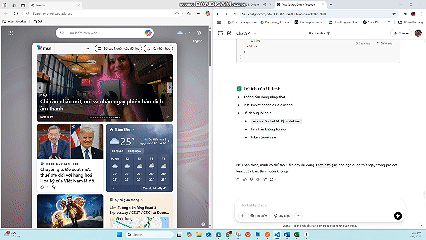

# 💬 Real-time Chat Application

A simple real-time chat app that allows users to register, log in, recover forgotten passwords via email, view and edit their profiles, and chat with each other through WebSockets using Socket.IO.

---

## 🚀 Features

- 🔐 User registration and login with JSON Web Tokens (JWT)
- ✅ Protected routes using JWT-based authentication
- 📧 Forgot password functionality using email via Nodemailer
- 👤 User profile viewing and editing
- 💬 Real-time private messaging using Socket.IO
- 📜 User list for selecting chat targets

---

## 🛠️ Tech Stack

### Frontend
- [ReactJS](https://reactjs.org/)
- Context API for global state management (auth, socket)
- Fetch API for communication with the backend

### Backend
- [Node.js](https://nodejs.org/)
- [Express.js](https://expressjs.com/)
- [Socket.IO](https://socket.io/)
- [JWT](https://github.com/auth0/node-jsonwebtoken) for authentication
- [Nodemailer](https://nodemailer.com/about/) for sending emails
- [MongoDB](https://www.mongodb.com/) with [Mongoose](https://mongoosejs.com/)

---

## 📦 Installation

### 1. Clone the repository

```bash
git clone https://github.com/your-username/Real-time-chat.git
cd Real-time-chat
```

### 2. Setup the backend
Go to the backend folder and install the dependencies:

```bash
cd backend
npm install
npm run dev
```

This will start the backend server at http://localhost:5000.

### 3. Setup the frontend
Go to the backend folder and install the dependencies:

```bash
cd ../frontend
npm install
npm run dev
```

This will start the frontend server at http://localhost:5173 (or as configured).

## 🔐 Environment Variables

For the backend, you will need to create a .env file with the following variables:

```bash
MONGO_URI=
JWT_SECRET=
EMAIL_USER=
EMAIL_PASS=
```

Replace `your_mongodb_connection_string` with your `MongoDB URI`, `your_jwt_secret` with your secret key for JWT, and `your_email@gmail.com` and `your_email_password` with your email for Nodemailer to send reset password emails.

## 📸 Preview



## 🧠 Project Goals

- Practice full-stack development using Node.js and React
- Implement secure JWT-based authentication
- Learn real-time communication using WebSockets
- Apply real-world email sending using Nodemailer

## 👨‍💻 Author

- Phạm Chí Vỹ 